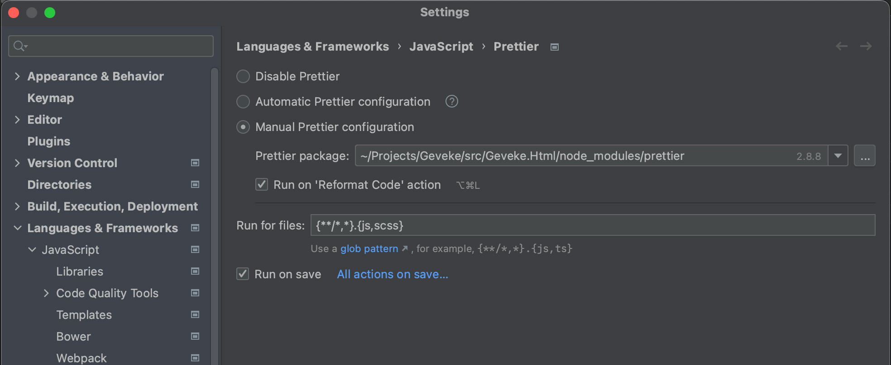
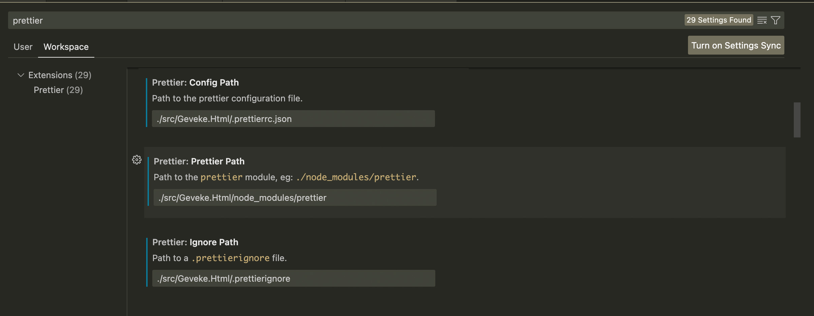

# Front-end environment for the New Aviva Site POC

## Prerequisites

See package.json, under 'volta', for the used node version. This version will automatically be used when you have Volta
installed (https://docs.volta.sh), but you could also just install this version manually (e.g. via NVM (on Windows)
or n (on Mac)).

## Setup

1. Install dependencies `npm install`.
2. First run the build task `npm run build`.
3. For development, run `npm run start` together with `npm run hbs`, a browser-window will open.

## Build only

`$ npm run build`

## Code formatting via Prettier

- Make sure your IDE formats the code via Prettier by using our *.prettierrc.json* configuration file.
- It should use the Prettier package in the project's node_modules folder.
- Use this glob pattern to make run Prettier for the correct files: `{**/*,*}.{js,scss}`.

These images give an example of a configuration setup in Webstorm and VSCode (images could be outdated):

### Webstorm:

### VSCode:

This image is adjusted a bit to only show the relevant parts. Make sure you have the Workspace tab selected.

